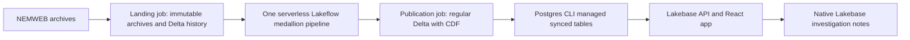

# Architecture

The pipeline libraries are explicit files in `bronze/`, `silver/`, and `gold/`. `bronze/parsed_records.py` declares the shared temporary view once. `common/` contains configuration and helpers imported by dataset definitions. Exploration notebooks are never pipeline libraries.

Bronze retains report history as streaming tables. Silver materialized views select corrections and enrich SCADA with registration. Gold materialized views retain the established table names and expectations. Directory names do not determine dataset types.

The refresh job serially lands registration, regional constraints/interconnectors, and critical price/demand/SCADA inputs, then updates the whole authored pipeline graph. A standalone context job lands registration and refreshes its three Bronze datasets. Run the full refresh afterwards to update dependent products. All schedules are paused at deployment.

Publication is a separate job using the bundle's serverless SQL warehouse. It merges each of the three products into a regular Delta table, updating corrections and inserting new keys without deleting absent history. Synced tables are separately managed through `databricks postgres`, not through bundle resources.

All application reads use fixed, bounded Lakebase SQL. A failed fuel or unit read degrades that panel independently. A failed regional read reports a page-level data error. The app service principal creates and owns `app_write`; the sync operator owns `app_read` and grants the app SELECT on exactly three synced tables.

`dev` and `lab` share all source. Explicit deployment identifiers isolate names, schema suffixes isolate data, and explicit Lakebase branches isolate app state. `lab` adds a runtime service principal. This root bundle has a new state namespace; no old deployment is adopted or destroyed.
