# Goal: deliver app-first NEMWEB Delta landing and prove it live

## Mission

Complete the app-first NEMWEB Delta-landing implementation in:

```text
/Users/david.okeeffe/Repos/agentic-energy-challenge
```

Use these repositories as read-only references:

```text
/Users/david.okeeffe/Repos/australian-energy-nemweb-analytics
/Users/david.okeeffe/Repos/8-gridsense-intelligence-hub
```

Replace the app-critical NEMWEB ingestion path with a reliable, app-scoped design:

```text
NEMWEB HTTP or deterministic snapshot
  → scheduled Spark Python landing Job
  → append-only Delta landing tables
  → Lakeflow Bronze
  → correction-aware Silver
  → five-minute Gold
  → app-serving Delta tables
  → nemweb_app
```

The implementation must populate and prove the two existing application contracts:

1. `gold_nem_app_region_status`;
2. `gold_nem_scada_generation_5min`.

This is an app-first change. Do not rework bids, trading, settlement, market notices, ML, dashboards, Genie, or unrelated workshop material unless an app-critical dependency requires a narrowly scoped adjustment.

## Current authorisation

The user authorises this task to:

- edit and test the repository implementation;
- run deterministic local tests and builds;
- run strict Databricks bundle validation with `--profile DEFAULT`;
- after local verification and independent review, deploy the isolated `live_evidence` target using `--profile DEFAULT`;
- fetch public live NEMWEB data through the deployed landing Job;
- run the required context Job once; and
- manually execute three critical live cycles and query their results.

This authorisation does not permit:

- committing, pushing, opening a pull request, merging, or publishing;
- deploying any target other than the approved isolated `live_evidence` target;
- changing grants beyond bundle-managed definitions already required by that isolated target;
- unpausing a schedule;
- enabling a continuous pipeline;
- using a destructive full refresh;
- modifying either reference repository; or
- recording private workspace URLs, tenant identifiers, credentials, tokens, or participant data.

All schedules must remain paused. Run the live cycles manually.

## Task graph

```mermaid
flowchart TD
    T0["T0 — Reconcile repository state<br/>Read instructions, Git status, miniwiki, and existing changes"]
    T1["T1 — Confirm app contracts<br/>Region status and fuel generation"]
    T2["T2 — Produce migration manifest<br/>Reference files, licences, schemas, and behaviours"]

    T3["T3 — Add source registry<br/>Folders, files, sections, schemas, and natural keys"]
    T4["T4 — Harden NEMWEB parser<br/>Direct/nested ZIPs, MMS sections, encoding, and quarantine"]

    T5["T5 — Implement Delta landing core<br/>Record IDs, append-only writes, and run manifests"]
    T6["T6 — Add snapshot landing<br/>Same contract without network access"]
    T7["T7 — Add live retrieval<br/>Lookback, retries, checksums, and fail-closed subjects"]

    T8["T8 — Wire landing Job<br/>Spark Python task, bundle variables, permissions, schedules paused"]
    T9["T9 — Rewire app Bronze inputs<br/>DispatchIS, SCADA, and registration only"]

    T10["T10 — Verify Silver/Gold semantics<br/>Corrections, interventions, AEST, UTC, and signed SCADA"]
    T11["T11 — Verify app serving<br/>Region status and generation by fuel"]

    T12["T12 — Run deterministic checks<br/>Focused tests, full suites, builds, and static checks"]
    T13["T13 — Independent review<br/>Security/data, edge cases, and regression"]
    T14["T14 — Remediate findings<br/>One writer, then repeat affected checks"]

    T15["T15 — Verify the named profile identity<br/>Expected workspace, CLI version, and variables"]
    T16["T16 — Strict bundle validation<br/>No deployment yet"]
    T17["T17 — Deploy live_evidence<br/>Schedules paused; no full refresh"]
    T18["T18 — Run context once<br/>Build registration dependencies"]

    T19A["T19a — Live cycle 1"]
    T19B["T19b — Live cycle 2<br/>Approximately five minutes later"]
    T19C["T19c — Live cycle 3<br/>Approximately five minutes later"]

    T20["T20 — Reconcile evidence<br/>Landing → Bronze → Silver → Gold → app serving"]
    T21["T21 — Final adjudication<br/>Check every criterion and unsupported claim"]
    T22["T22 — Record handoff<br/>Miniwiki, files, commands, evidence, and residual risk"]

    T0 --> T1
    T0 --> T2
    T1 --> T3
    T2 --> T3
    T2 --> T4

    T3 --> T5
    T4 --> T5
    T5 --> T6
    T5 --> T7

    T6 --> T8
    T7 --> T8
    T8 --> T9
    T9 --> T10
    T10 --> T11

    T11 --> T12
    T12 --> T13
    T13 --> T14
    T14 --> T12

    T13 -->|No blocking findings| T15
    T15 --> T16
    T16 --> T17
    T17 --> T18
    T18 --> T19A
    T19A --> T19B
    T19B --> T19C

    T19C --> T20
    T20 --> T21
    T21 -->|Blocking finding| T14
    T21 -->|Accepted| T22
```



### Parallelism and gates

- T1 and T2 may run in parallel as read-only investigations.
- T3 and T4 may be analysed in parallel, but use one writer in the shared checkout.
- T13 reviews may run in parallel against a stable diff.
- T19a–T19c must remain sequential to demonstrate three distinct NEMWEB cycles.
- Do not begin workspace work until T12–T14 are green.
- Do not claim completion until T20 and T21 pass.

## Repository safety

Before editing:

1. Read all applicable `AGENTS.md` files.
2. Read `README.md`, `PRE-REQUISITES.md`, `foundation/AGENTS.md`, `foundation/Instructions.md`, and the repository requirement, plan, implementation, miniwiki, and NEMWEB skills.
3. Read `miniwiki/now.md` and `miniwiki/features/full-nemweb-lakeflow.md`.
4. Inspect the current Git status and diff.
5. Preserve all unrelated work.

At the time this goal was prepared, unrelated changes existed in:

- `miniwiki/features/full-nemweb-lakeflow.md`;
- `workshop/exercises/`.

This file, `goal.md`, is intentionally replaced by the current goal. Do not overwrite, revert, stage, or absorb the other unrelated changes. If new overlapping changes appear, stop and report the conflict.

The reference repositories also have unrelated changes. Treat them as read-only and inspect their Git diffs before relying on uncommitted code.

## Required Databricks preparation

Before writing pipeline or bundle code, load the current official skills for:

- Databricks core and CLI/profile handling;
- Lakeflow Spark Declarative Pipelines; and
- Databricks Asset Bundles.

Read the exact modern Python references for streaming tables, materialised views, expectations, Delta streaming reads, and pipeline bundle configuration before implementation.

Use modern `pyspark.pipelines` APIs only. Do not introduce:

- `import dlt`;
- `dlt.read` or `dlt.read_stream`;
- `dp.read` or `dp.read_stream`;
- `LIVE.*`;
- manual `writeStream.start()` inside a declarative pipeline; or
- deprecated continuous-pipeline configuration.

## Fixed data semantics

Preserve these contracts:

- NEM market intervals are interval-ending fixed AEST, UTC+10 with no daylight saving.
- Processing, retrieval, landing, ingestion, and publication timestamps are UTC instants.
- Bronze retains source versions and corrections.
- A repeated identical source record is idempotent.
- A changed archive or source row remains distinguishable as a correction.
- Both intervention rows remain governed.
- Default app analysis uses `is_effective_run`.
- `Dispatch_SCADA` is signed actual output in MW.
- Negative battery or dispatchable-load values are valid.
- Five-minute SCADA is not availability or curtailment.
- Facility region and fuel enrichment comes from governed NEMWEB registration data.
- Unknown DUIDs survive with explicit unknown or partial-enrichment status.
- Snapshot and live data remain isolated and cannot be confused.
- Snapshot rows are never live evidence.
- No failed or partial landing run becomes visible as a complete app refresh.

## App-critical source scope

Implement and validate only these NEMWEB subjects.

### DispatchIS_Reports

- `DISPATCH,PRICE`;
- `DISPATCH,REGIONSUM`;
- `DISPATCH,CONSTRAINT`;
- `DISPATCH,INTERCONNECTORRES`.

### Dispatch_SCADA

- `DISPATCH,UNIT_SCADA`.

### Registration context

- `PARTICIPANT_REGISTRATION,DUDETAILSUMMARY`;
- `PARTICIPANT_REGISTRATION,DUALLOC`;
- `PARTICIPANT_REGISTRATION,GENUNITS`.

Do not infer that every table present in a reference repository is deployed or working. In particular, the folder-oriented custom DataSource in `australian-energy-nemweb-analytics` is a design reference, not code to copy wholesale: its dispatch chain is disabled in that repository, its filename offset requires hardening, and partial parse failures are not sufficiently fail-closed for this application.

Use GridSense for the simple separation between external HTTP ingestion and Lakeflow transformation, not for its two-hour retention, heuristic fuel classification, mutable correction handling, or limited test coverage.

## Required architecture

### 1. Central source registry

Create one source-of-truth registry for every app-critical subject. It must define, as applicable:

- report family;
- CURRENT folder;
- filename prefix and suffix;
- MMS section group, name, and version;
- landing table;
- source fields and types;
- required fields;
- natural key;
- correction ordering fields;
- expected cadence; and
- app dependency.

Derive discovery, parsing, routing, and tests from this registry. Do not duplicate folder-to-section mappings across the lander and Bronze modules.

### 2. Parser

Adapt the useful parser behaviour from `australian-energy-nemweb-analytics`, while preserving the stronger safety properties already present in this repository.

The parser must:

- support the real direct and, where relevant, nested NEMWEB ZIP shapes;
- validate archive paths, member types, expansion limits, and compression ratios;
- parse all CSV members and interleaved C/I/D/F records;
- route data by explicit MMS section identity;
- preserve source headers and unexpected columns;
- report malformed records rather than silently skipping them;
- make encoding behaviour explicit and covered by fixtures;
- retain negative prices, negative flow, and negative SCADA values; and
- preserve raw source identity and row number.

Do not silently fall back to an untyped all-string business schema.

### 3. Delta landing Job

Implement a Spark Python landing task outside the declarative pipeline.

It must:

- support `snapshot` and `live` modes;
- use bounded listing, download, retry, response-size, and lookback limits;
- download each source ZIP once per cycle;
- retain immutable raw ZIP/checksum and manifest evidence where already required;
- create deterministic source-record identifiers;
- write app-critical source rows to Delta;
- use append-only commits for source versions;
- avoid overwriting corrections;
- prevent duplicate insertion on retries;
- record the landing run, source files, row counts, rejected rows, and status;
- expose only successful complete runs to downstream Bronze processing;
- fail the critical cycle if any required app subject is missing or fails; and
- distinguish “no new source” from a failed or partial source.

Do not use a mutable `MERGE` that overwrites historical source versions. If `MERGE` is used for run metadata, it must not destroy source history.

### 4. Lakeflow bridge

Keep existing published Bronze table names and dataset types wherever possible.

Rewire only the app-critical Bronze definitions to read the Delta landing sources. Preserve their current expectations and provenance columns.

The Lakeflow pipeline must not perform HTTP requests.

Do not change a streaming table into a materialised view in place. If an incompatible dataset-type or checkpoint migration is unavoidable, stop and present a non-destructive migration plan instead of using a full refresh.

### 5. Silver, Gold, and app serving

Keep existing Silver and Gold contracts unless a demonstrated landing-schema difference requires a small correction.

Prove:

- PRICE and REGIONSUM join on interval, region, and intervention;
- latest valid corrections are selected deterministically;
- both intervention rows remain available;
- exactly one effective run exists for ordinary app analysis;
- SCADA deduplicates by interval and DUID without deleting negative output;
- registration is evaluated at the governed data-derived instant;
- unknown registration joins do not drop SCADA rows;
- generation aggregates at interval, region, and fuel;
- constraints and interconnector values remain market-wide in the app contract;
- the app query filters `is_effective_run = TRUE`; and
- the generation query does not claim intervention, availability, settlement, or curtailment semantics.

## Expected implementation surfaces

Confirm the exact list after inspection, but expect to add or modify:

- `nemweb_foundation/agentic_energy/nemweb/source_registry.py`;
- `nemweb_foundation/agentic_energy/nemweb/delta_lander.py`;
- `nemweb_foundation/scripts/land_nemweb_delta.py`;
- `nemweb_foundation/agentic_energy/nemweb/lander.py`;
- `nemweb_foundation/agentic_energy/nemweb/parser.py`;
- `nemweb_foundation/agentic_energy/nemweb/pipeline/io.py`;
- `nemweb_foundation/agentic_energy/nemweb/pipeline/bronze_dispatchis.py`;
- `nemweb_foundation/agentic_energy/nemweb/pipeline/bronze_scada.py`;
- `nemweb_foundation/agentic_energy/nemweb/pipeline/bronze_registration.py`;
- `nemweb_foundation/resources/nemweb_lander.job.yml`;
- `nemweb_foundation/resources/nemweb.pipeline.yml`;
- evidence, bundle-contract, parser, landing, Bronze, snapshot, and app-contract tests; and
- `NOTICE.md` or `DATA_LICENSES.md` only where direct adaptation requires an attribution update.

Do not modify generated wheels, bundle state, caches, compiled frontend assets, or the reference repositories.

## Ordered execution

### T0 — Reconcile repository state

Read all routed instructions, the current miniwiki, Git status, and Git diff. Record unrelated changes and stop on overlap.

### T1 — Confirm app dependencies

Trace both app queries through app-serving, Gold, Silver, Bronze, landing, registration, and bundle resources. Produce the exact dependency list.

### T2 — Produce migration and provenance manifest

Map every adapted concept or file from both reference repositories to its destination. Record licence and attribution implications. Distinguish committed reference code, uncommitted reference work, disabled code, and demo-only code.

### T3 — Add the source registry

Add a single registry for the eight app-critical source sections. Test registry completeness, unique destinations, natural keys, required fields, and source cadence.

### T4 — Harden parser behaviour

Add failing real-shape fixtures and tests first, then support the required direct/nested ZIP and MMS section behaviour without weakening existing archive safety.

### T5 — Implement Delta landing core

Add deterministic source-record IDs, append-only table writes, idempotent retry behaviour, run manifests, required-subject reconciliation, and partial-run isolation.

### T6 — Implement snapshot landing

Run the existing deterministic snapshot through the same Delta landing contract. Keep snapshot and live roots, tables, or run classifications unambiguous.

### T7 — Implement live retrieval

Use the source registry for bounded CURRENT discovery. Retain checksums, publication/retrieval timestamps, retries, error details safe for logs, and complete-run checks.

### T8 — Wire the landing Job

Add the Spark Python task and required bundle settings. Keep schedules paused and preserve the existing orchestration dependency order.

### T9 — Rewire app-critical Bronze

Switch only the selected DispatchIS, SCADA, and registration Bronze tables to the successful Delta landing sources. Preserve names, types, expectations, and provenance.

### T10 — Verify Silver and Gold

Prove corrections, interventions, AEST/UTC handling, signed values, facility enrichment, and natural-key uniqueness remain correct.

### T11 — Verify app serving

Reconcile both Gold sources to their app-serving tables and reviewed app queries. Ensure the app receives the required fields and no unsupported semantic claim is introduced.

### T12 — Run deterministic local verification

Run focused tests throughout, then the complete required suites, builds, static checks, and `git diff --check`.

### T13 — Run independent review

Review the stable diff for security/data correctness, malformed-input and correction edge cases, and caller/bundle/app regressions.

### T14 — Remediate findings

Use one writer to fix accepted findings. Repeat every affected focused and complete check. Return to review if the fix changes behaviour materially.

### T15 — Verify workspace identity

Check the CLI version and `DEFAULT` authentication. Stop if the profile identifies an unexpected workspace or the selected variables do not describe an isolated target.

### T16 — Validate the bundle

Run strict bundle validation against the approved profile and target. Do not deploy until it passes.

### T17 — Deploy `live_evidence`

Deploy only the isolated `live_evidence` target. Keep schedules paused and do not use a full refresh.

### T18 — Build registration context

Run the context Job once, resolve the exact pipeline update, poll it to a terminal state, and verify registration dependencies before critical cycles.

### T19 — Run three live cycles

Run the critical refresh manually three times, approximately five minutes apart. Resolve and poll each exact pipeline update and retain cycle-specific evidence.

### T20 — Reconcile end to end

For each cycle, reconcile source listing, landed rows, Bronze, Silver, Gold, app serving, quality metrics, duplicate checks, and timestamps.

### T21 — Final adjudication

Compare the implementation and evidence with every completion criterion. Reject unsupported live, cadence, correction, intervention, or app-readiness claims.

### T22 — Record the handoff

Update the applicable miniwiki page with the objective, changed files, commands and results, evidence, uncertainty, workspace state, and next action.

## Subagent execution

Before delegation, load the pi-subagents guide and list executable agents.

Use exactly one top-level asynchronous workflow for the multi-agent work.

Recommended workflow:

1. In parallel, use read-only scouts for:
   - the target repository and app contracts;
   - `australian-energy-nemweb-analytics`;
   - GridSense; and
   - requirements and migration-manifest review.
2. Use a planner to turn those reports into the exact file/table plan.
3. Use one sequential writer in the shared checkout for implementation slices:
   - registry and parser;
   - Delta landing;
   - bundle and Lakeflow bridge; and
   - evidence and documentation.
4. Against stable diffs, run independent read-only reviewers in parallel:
   - `security-data-reviewer`;
   - `edge-case-reviewer`; and
   - `regression-reviewer`.
5. Return findings to the same sequential writer for remediation.
6. Use `verification-adjudicator` for the final acceptance decision.

The parent agent owns scope, workspace authority, integration, test execution, evidence, and the final conclusion.

## Deterministic tests

Add or retain focused tests for:

- registry completeness and uniqueness;
- one folder ZIP fanning out to every required section;
- direct and nested ZIP layouts;
- multiple CSV members;
- malformed record and footer handling;
- explicit encoding behaviour;
- unknown columns and schema drift;
- duplicate source files;
- identical checksum relisting;
- same filename with changed checksum;
- deterministic record identity;
- retry idempotency;
- partial-run invisibility;
- required-subject failure;
- correction ordering;
- intervention preservation and effective-run selection;
- fixed-AEST interval boundaries;
- UTC processing timestamps;
- signed prices, flows, and SCADA values;
- unknown DUID preservation;
- unchanged snapshot Gold results;
- pipeline dependency wiring;
- bundle task order and paused schedules; and
- both app-serving schemas and queries.

Where possible, demonstrate red/green behaviour against the previous ingestion implementation rather than merely adding tests that pass both versions.

## Required local validation

Run focused checks throughout, followed by:

```bash
python3 scripts/validate-miniwiki.py
uv run --extra test python -m pytest
rm -rf dist && uv build --wheel --out-dir dist
(
  cd nemweb_foundation
  uv run python scripts/validate_nemweb_snapshot.py
  python3 scripts/check_modern_pipeline_apis.py
  rm -rf dist && uv build --wheel --out-dir dist
)
git diff --check
```

Also run the relevant `nemweb_app` typecheck, unit tests, build, and smoke tests if any app query contract or generated type changes.

Report exact commands, exit codes, failures, fixes, and residual risk.

## Workspace gate

Before any workspace operation:

1. Confirm the Databricks CLI satisfies the loaded skill’s minimum version.
2. Run `databricks auth describe --profile DEFAULT`.
3. Stop if the profile is absent, unauthenticated, or points to an unexpected workspace.
4. Confirm bundle variables name an isolated live-evidence schema, landing resources, and app-serving schema.
5. Ensure every schedule is PAUSED.
6. Run strict validation with `--profile DEFAULT`.

Do not include workspace URLs or tenant identifiers in committed evidence.

## Deployment and live proof

After local checks and independent review pass:

1. Deploy only the isolated `live_evidence` target.
2. Keep every schedule paused.
3. Do not use a full refresh.
4. Run the context Job once to build registration dependencies.
5. Verify it completed successfully and its exact pipeline update is terminal.
6. Manually run the critical refresh three times, approximately five minutes apart.
7. For every cycle, resolve and poll the exact pipeline update. Do not infer success from the pipeline’s top-level state.
8. If a cycle overlaps or queues, preserve the five-minute source evidence and report actual processing latency rather than changing the schedule or fabricating cadence.

For each cycle, capture:

- NEMWEB source filename and newest source interval;
- archive checksum;
- landing run ID and status;
- landed row count by required subject;
- rejected or quarantined count;
- Bronze, Silver, Gold, and app-serving row counts;
- Bronze and Gold watermarks;
- source publication, landing, ingestion, and Gold publication timestamps;
- source-to-Gold and landed-to-Gold lag;
- duplicate-natural-key result;
- correction-selection result;
- intervention and effective-run result;
- Lakeflow expectation result; and
- landing Job, pipeline update, orchestration Job, and app-serving task outcome.

A no-new-source cycle is valid only when the source listing and existing watermark prove there was nothing new. A partial or failed landing is not a successful cycle.

## Completion criteria

The goal is complete only when:

1. The app-scoped registry covers every required source subject.
2. The same parser contract supports snapshot and live inputs.
3. Landing writes append-only, replayable Delta source versions.
4. Retries do not duplicate rows.
5. Corrections remain distinguishable and reach Silver/Gold deterministically.
6. Failed or partial runs cannot appear as complete app data.
7. Existing fixed-AEST, UTC, correction, intervention, signed-SCADA, and enrichment contracts pass.
8. Both app-serving tables contain reconciled rows.
9. All focused and complete local checks pass.
10. Strict bundle validation passes.
11. Three sequential live cycles satisfy the evidence contract.
12. Independent review and final adjudication have no unresolved blocking findings.
13. Schedules remain paused.
14. No destructive full refresh, secret exposure, unrelated-file overwrite, commit, push, merge, or deployment outside `live_evidence` occurred.

## Stop conditions

Stop and report rather than guessing if:

- existing uncommitted work overlaps a required file;
- reference code licensing or attribution is unclear;
- real NEMWEB file structure contradicts the registry or parser contract;
- the implementation would require changing an existing dataset type in place;
- a full refresh appears necessary;
- the named profile identifies an unexpected workspace;
- the target is not isolated;
- required permissions or serverless capabilities are unavailable;
- NEMWEB egress is blocked or the public source is unavailable;
- a required subject is missing;
- live landing is partial;
- three-cycle evidence cannot be obtained; or
- a reviewer finds unresolved data-loss, correction, intervention, timezone, security, or app-contract risk.

A blocked live source does not justify labelling the implementation complete.

## Final response contract

Report:

1. implemented architecture;
2. changed files;
3. landing and Lakeflow table graph;
4. tests and commands actually run;
5. bundle validation and deployment actions;
6. three-cycle evidence;
7. app-serving reconciliation;
8. independent review findings and disposition;
9. schedules and workspace state left behind;
10. residual risks; and
11. whether every completion criterion is met.
